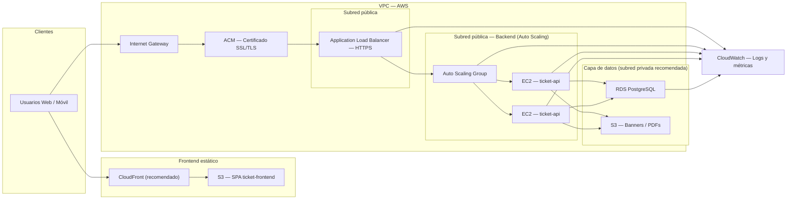

# Arquitectura AWS — Plataforma de Boletaría Digital

Documento de referencia para el despliegue en AWS de **ticket-frontend** (SPA React) y **ticket-api** (NestJS + PostgreSQL). Alineado con el diagrama de infraestructura del equipo y con el código actual del monorepo.

---

## 1. Visión general

| Capa | Tecnología | Servicio AWS |
|------|------------|--------------|
| Cliente | Navegador web / móvil | — |
| Frontend | React + Vite + TanStack Router | **S3** (+ **CloudFront** recomendado) |
| API | NestJS 11, Prisma, JWT, Socket.IO | **EC2** en **Auto Scaling Group** |
| Base de datos | PostgreSQL 16 | **RDS** |
| Archivos | Banners de eventos (PDF de boletos: planificado) | **S3** (bucket de assets) |
| TLS | Certificado público | **ACM** |
| Entrada HTTP(S) | Balanceo y health checks | **Application Load Balancer** |
| Observabilidad | Logs y métricas | **CloudWatch** |

### Flujo de tráfico (resumen)

1. **Usuarios** cargan la SPA desde **S3** (idealmente vía **CloudFront** con HTTPS).
2. La SPA llama a la API REST (`/api/v1/*`) y al WebSocket de inventario (`/inventory`) contra el dominio del **ALB**.
3. El **ALB** termina TLS (certificado **ACM**) y reenvía tráfico HTTP al **ASG** de instancias **EC2**.
4. Cada instancia NestJS lee/escribe en **RDS PostgreSQL** y sube assets a **S3**.
5. **CloudWatch** recibe logs y métricas de ALB, ASG, EC2 y RDS.

---

## 2. Diagrama de arquitectura

### 2.1 Diagrama lógico (Mermaid)



### 2.2 Diagrama con la librería `diagrams` (Python)

Script incluido en [`scripts/arquitectura_boletaria.py`](scripts/arquitectura_boletaria.py). Genera `arquitectura_boletaria.png`:

```bash
# Requisitos: Graphviz instalado en el sistema (brew install graphviz / apt install graphviz)
cd ticket-api
python -m venv .venv-diagrams && source .venv-diagrams/bin/activate
pip install diagrams
python scripts/arquitectura_boletaria.py
```

El script original del equipo se conserva con pequeños ajustes de etiquetas para reflejar los dos buckets S3 y la separación frontend/API.

---

## 3. Mapeo diagrama ↔ código

| Componente en AWS | Proyecto / módulo | Responsabilidad |
|-------------------|-------------------|-----------------|
| S3 Frontend | `ticket-frontend` (`pnpm build` → assets estáticos) | Catálogo, checkout, dashboard admin, escaneo QR |
| EC2 API | `ticket-api` (Dockerfile, puerto **3000**) | REST `/api/v1`, Swagger `/docs`, WebSocket `/inventory` |
| RDS | Prisma + `DATABASE_URL` | Usuarios, eventos, órdenes, tickets, inventario |
| S3 Assets | `src/aws/s3.service.ts` | Banners (`events/{eventId}/*`); PDFs: previsto, no implementado aún |
| ALB health | `GET /api/v1/health`, `GET /api/v1/health/ready` | Liveness y readiness (conexión DB) |
| JWT / roles | `src/auth/*` | `CUSTOMER`, `ADMIN`; refresh tokens en DB |
| Inventario en vivo | `src/websocket/inventory.gateway.ts` | Socket.IO namespace `/inventory` |

### Variables de entorno clave

**API (EC2 / Secrets Manager / SSM):**

| Variable | Uso |
|----------|-----|
| `DATABASE_URL` | Endpoint RDS PostgreSQL |
| `JWT_ACCESS_SECRET`, `JWT_REFRESH_SECRET` | Firmado de tokens (≥ 32 caracteres) |
| `CORS_ORIGINS` | Origen(es) del frontend en S3/CloudFront |
| `FRONTEND_BASE_URL` | URLs en emails / redirecciones |
| `S3_BUCKET`, `S3_PUBLIC_BASE_URL` | Bucket de assets y URL pública (o dominio CloudFront del bucket) |
| `AWS_REGION` | Región; credenciales vía **IAM instance profile** (preferido) o keys en dev |

**Frontend (build-time Vite):**

| Variable | Uso |
|----------|-----|
| `VITE_API_BASE_URL` | URL pública del ALB, p. ej. `https://api.boletaria.example.com` |
| `VITE_SOCKET_PATH` | Ruta Socket.IO (default `/socket.io`) |

---

## 4. Revisión del diagrama propuesto

### ✅ Fortalezas

- **Separación clara** entre frontend estático (S3) y API dinámica (EC2 + ALB).
- **Auto Scaling Group** adecuado para picos de venta de boletos.
- **RDS PostgreSQL** coincide con Prisma y el esquema actual.
- **Dos usos de S3** (SPA vs assets/PDF) es el patrón correcto.
- **ACM + ALB HTTPS** es la forma estándar de TLS en AWS.
- **CloudWatch** cubre observabilidad mínima viable.

### ⚠️ Ajustes recomendados antes de producción

| Tema | Estado en el diagrama | Recomendación |
|------|----------------------|---------------|
| **CloudFront delante del frontend** | No aparece | Añadir CloudFront para HTTPS en el dominio del sitio, compresión, cache y soporte SPA (`index.html` en 404). |
| **Subred privada para RDS** | “Capa de datos” genérica | RDS **solo en subred privada**; SG permite 5432 **únicamente** desde el SG del ASG. |
| **Backend en subred pública** | EC2 en subred pública | Aceptable para MVP/universidad. En producción: EC2 en **subred privada** + **NAT Gateway** para salida (Prisma migrate, npm, S3, parches). |
| **WebSocket multi-instancia** | No detallado | Con 2+ EC2, activar **sticky sessions** en el target group del ALB **o** adapter Redis para Socket.IO; si no, el inventario en vivo falla entre instancias. |
| **Secretos** | No aparece | Usar **SSM Parameter Store** o **Secrets Manager** para JWT y `DATABASE_URL`; evitar `.env` en la AMI. |
| **DNS** | No aparece | **Route 53**: `www` → CloudFront, `api` → ALB. |
| **PDF en S3** | Bucket “Boletos PDF” | El código actual genera **QR en PNG bajo demanda** (`GET /tickets/:code/qr`); el bucket PDF es evolución futura, no requisito del MVP. |
| **Credenciales S3 en EC2** | Implícito | Preferir **IAM instance profile** en lugar de `AWS_ACCESS_KEY_ID` en producción (`s3.service.ts` ya soporta credenciales por defecto del SDK). |
| **WAF / rate limiting** | No aparece | Considerar **AWS WAF** en ALB/CloudFront ante abuso en checkout y login. |

### Diagrama vs flujo real del certificado

En AWS, **ACM** no es un “salto” de red independiente: el certificado se **asocia al listener HTTPS del ALB** (y/o a CloudFront). En documentación académica está bien representarlo como componente de seguridad; en implementación se configura en el listener `:443`.

---

## 5. Red y seguridad (Security Groups)

```
Internet
   │
   ▼
[ ALB SG ]  inbound: 443 desde 0.0.0.0/0
   │
   ▼
[ EC2 SG ]  inbound: 3000 desde ALB SG; SSH/SSM restringido
   │
   ├──► [ RDS SG ]  inbound: 5432 desde EC2 SG
   └──► S3 / Internet (vía NAT si EC2 en subred privada)
```

- **Frontend S3**: bucket privado; acceso público solo vía OAI/OAC de CloudFront.
- **S3 assets**: política que permita lectura pública de objetos bajo `events/*` (banners) o URLs firmadas si se requiere más control.
- **CORS**: `CORS_ORIGINS` debe listar el origen exacto del frontend, no `*` en producción.

---

## 6. Despliegue por componente

### 6.1 Frontend (S3 + CloudFront)

1. `pnpm install && pnpm build` en `ticket-frontend` con `VITE_API_BASE_URL` apuntando al ALB.
2. Sincronizar `dist/` al bucket S3 (`aws s3 sync dist/ s3://...`).
3. Invalidar cache CloudFront tras cada release.
4. Configurar error document / custom error response: **403/404 → `/index.html`** para rutas del SPA.

### 6.2 API (EC2 + ASG + ALB)

1. Construir imagen Docker desde [`Dockerfile`](Dockerfile) o desplegar artefacto Node.
2. **Launch template**: AMI, instance profile (S3 + SSM), user-data que arranca el contenedor.
3. Target group: puerto **3000**, health check `GET /api/v1/health`.
4. Listener ALB **443** → target group; certificado ACM en el listener.
5. Al arrancar, [`docker-entrypoint.sh`](docker-entrypoint.sh) ejecuta `prisma migrate deploy` y luego la app.

### 6.3 Base de datos (RDS)

1. PostgreSQL 16, Multi-AZ opcional según SLA.
2. Backups automáticos y ventana de mantenimiento definida.
3. `DATABASE_URL` con SSL si la política de la org lo exige.

### 6.4 Auto Scaling

| Señal | Acción sugerida |
|-------|-----------------|
| CPU > 70% (5 min) | Scale out (+1 instancia) |
| CPU < 30% (10 min) | Scale in |
| ALB `TargetResponseTime` | Alarmas en CloudWatch |
| Picos de venta | Mínimo 2 instancias en horario de evento |

---

## 7. Observabilidad

| Fuente | Qué registrar |
|--------|----------------|
| EC2 / contenedor | stdout de NestJS → **CloudWatch Logs** (agent o awslogs driver) |
| ALB | Access logs → S3 + métricas 4xx/5xx, latencia |
| RDS | Enhanced Monitoring, Performance Insights |
| ASG | Desired / InService / Pending |
| Alarmas | 5xx ALB, health check fallido, CPU RDS, espacio en disco |

Endpoints útiles para monitoreo sintético:

- `GET /api/v1/health` — proceso vivo
- `GET /api/v1/health/ready` — PostgreSQL accesible

---

## 8. Flujos de negocio en la arquitectura

### Compra de boleto

```
Usuario → CloudFront/S3 (SPA)
       → ALB → EC2: POST /api/v1/orders
       → RDS (reserva PENDING, TTL configurable)
       → WebSocket broadcast inventario (ASG)
       → EC2: POST /api/v1/orders/:id/mock-pay
       → RDS (PAID, emisión tickets) + QR disponible vía API
```

### Validación en puerta (admin)

```
Admin → SPA dashboard → ALB → EC2: POST /api/v1/qr/validate
     → RDS (ticket USED)
```

### Banner de evento

```
Admin → multipart upload → ALB → EC2 → S3 (events/{id}/...)
     → URL pública devuelta y guardada en RDS
```

---

## 9. Evolución futura (fuera del diagrama actual)

- **ElastiCache (Redis)** para Socket.IO adapter y cache de sesiones.
- **RDS Proxy** para pooling bajo muchas conexiones EC2.
- **SQS + Lambda** para generación asíncrona de PDF y envío de correo.
- **CI/CD**: GitHub Actions → ECR/AMI → ASG rolling update; frontend → S3 sync.
- **Pagos reales**: integración PSP; webhooks en rutas dedicadas detrás del mismo ALB.

---

## 10. Checklist pre-go-live

- [ ] Certificado ACM validado en la región del ALB
- [ ] RDS en subred privada; sin IP pública
- [ ] Secrets en SSM/Secrets Manager, no en repositorio
- [ ] `CORS_ORIGINS` y `VITE_API_BASE_URL` alineados con dominios reales
- [ ] Health checks ALB verdes en `/api/v1/health`
- [ ] Sticky sessions o Redis si ASG > 1 instancia y se usa WebSocket
- [ ] Backups RDS probados (restore de prueba)
- [ ] CloudFront + S3 frontend con HTTPS
- [ ] IAM instance profile con permisos mínimos en bucket S3 de assets
- [ ] Prueba de concurrencia: `pnpm run test:e2e:concurrency` contra RDS de staging

---

## 11. Documentos relacionados

- [`DEPLOYMENT.md`](DEPLOYMENT.md) — notas operativas de despliegue en EC2/ASG
- [`API.md`](API.md) — contrato HTTP/WebSocket para el frontend
- [`scripts/arquitectura_boletaria.py`](scripts/arquitectura_boletaria.py) — generación del diagrama PNG

---

*Última revisión: alineada con ticket-api (NestJS + Prisma + S3 banners + Socket.IO inventario) y ticket-frontend (Vite SPA).*
