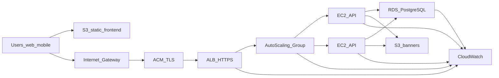

# Deployment Notes (AWS)

Operational notes for deploying this API on AWS (ALB + Auto Scaling + RDS + S3 + CloudWatch). Local `docker-compose.yml` is for development only.

For the full step-by-step guide (local setup, AWS, CI/CD), see **[IMPLEMENTATION.md](IMPLEMENTATION.md)**.  
For architecture diagrams and security groups, see **[ARCHITECTURE.md](ARCHITECTURE.md)**.

---

## Target AWS topology

Users reach a **static frontend** on **S3** (optionally behind CloudFront) and the **API** through **HTTPS** terminated at **ACM** on an **Application Load Balancer**, which forwards to an **Auto Scaling Group** of **EC2** instances running this NestJS service.



### Buckets

- **S3 (frontend):** static assets for the web app.
- **S3 (API assets):** event banners — EC2 instance profile needs `s3:PutObject` / `GetObject` / `DeleteObject` on prefixes such as `events/*`. Ticket PDFs in S3 are **not implemented** yet.

### Networking

- **RDS PostgreSQL** in **private subnets**; security group allows inbound **only from the EC2/ASG security group** on port 5432.
- **EC2:** security group allows the ALB security group to reach app port **3000**; restrict SSH or prefer SSM Session Manager.

---

## Application configuration on EC2 / ASG

| Variable | Source |
|----------|--------|
| `DATABASE_URL` | RDS endpoint |
| `JWT_ACCESS_SECRET`, `JWT_REFRESH_SECRET` | SSM Parameter Store or Secrets Manager (≥ 32 chars) |
| `S3_BUCKET`, `S3_PUBLIC_BASE_URL` | Assets bucket (optional until admin banner uploads are needed) |
| `CORS_ORIGINS` | Frontend CloudFront/S3 origin(s) — not `*` in production |
| `AWS_REGION` | Same region as S3/RDS; prefer IAM instance profile over access keys |

---

## Load balancer and scaling

- **Health checks:** `GET /api/v1/health` (liveness); optional `GET /api/v1/health/ready` (PostgreSQL).
- **Socket.IO (`/inventory`):** with multiple EC2 instances, enable **sticky sessions** on the ALB target group **or** adopt a **Redis adapter** for Socket.IO. Until then, treat live inventory WebSockets as best-effort; REST remains the source of truth.

---

## TLS

- **ACM** certificate on the **ALB** for public HTTPS. The Node process can stay HTTP behind the ALB.

---

## Observability

- Application logs → **CloudWatch Logs** (agent or container log driver).
- ALB access logs, RDS Enhanced Monitoring, ASG metrics.

---

## Build and migrate

```bash
docker build -t ticket-api .
docker run -p 3000:3000 --env-file .env.production ticket-api
```

- [`docker-entrypoint.sh`](docker-entrypoint.sh) runs `prisma migrate deploy` before starting the app.
- After clone: `pnpm install`, `pnpm build` (includes `prisma generate` via `prebuild`).

---

## Concurrency check

With Postgres available:

```bash
pnpm run test:e2e:concurrency
```

Run against staging RDS before go-live.

---

## Configuration deferred to later

| Item | Status |
|------|--------|
| S3 banner bucket | Code ready — set env when needed |
| Real payment provider | Mock pay only today |
| Email / PDF pipeline | Not implemented |
| CI/CD deploy to AWS | CI validates build; deploy is manual (see IMPLEMENTATION.md) |
