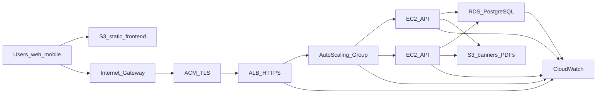

# Deployment notes (AWS)

This API fits the target topology below (ALB + Auto Scaling + RDS + S3 + CloudWatch). Local/docker-compose remains useful for development only.

## Target AWS topology (reference)

Aligned with the **VPC** layout you are using: users reach a **static frontend** on **S3** (optionally behind CloudFront, not shown in all diagrams) and the **API** through **HTTPS** terminated at **ACM** on an **Application Load Balancer**, which forwards traffic to an **Auto Scaling Group** of **EC2** instances running this NestJS service.

**Buckets**

- **S3 (frontend)**: static assets for the SPA; no IAM keys on EC2 for this bucket unless you generate artifacts from the backend.
- **S3 (API assets)**: banners and optional ticket PDFs — EC2 instance profile should allow `s3:PutObject` / `GetObject` / `DeleteObject` only on this bucket (and prefixes such as `events/*`, `tickets/*`).

**Networking**

- **RDS PostgreSQL** should live in **private subnets** with security groups allowing inbound **only from the EC2/ASG security group** on the DB port (5432). Do not expose RDS to the internet.
- **EC2** (per your diagram in public subnets behind the ALB): security group allows **22** from restricted IPs (bastion/bastion-less with SSM Session Manager preferred), and allows the ALB security group to reach the app port (e.g. **3000**).

## Application configuration on EC2 / ASG

1. **DATABASE_URL** → RDS endpoint (TLS optional via RDS proxy / parameter groups as you mature).
2. **JWT_ACCESS_SECRET** / **JWT_REFRESH_SECRET** (≥32 chars) via **SSM Parameter Store** or **Secrets Manager**, injected by launch template / user-data / container env.
3. **S3_BUCKET**, **S3_PUBLIC_BASE_URL** (or CloudFront domain) for object URLs returned to clients.
4. **CORS_ORIGINS**: origins for the **S3 website / CloudFront** frontend URL(s), not `*` in production.

## Load balancer and scaling

- **Target group health checks**: `GET /api/v1/health` (liveness); optionally a deeper check with `GET /api/v1/health/ready` (PostgreSQL) using a appropriate matcher and threshold so draining instances do not kill traffic prematurely.
- **Socket.IO (`/inventory` namespace)**: with **multiple EC2 instances**, enable **sticky sessions** on the ALB target group **or** adopt the **Redis adapter** for Socket.IO so room broadcasts work across instances. Until then, treat inventory WebSockets as best-effort and keep REST as source of truth.

## TLS

- **ACM** certificate on the **ALB** for public HTTPS. The Node process can stay HTTP behind the ALB (listener forwards to target port).

## Observability

- Ship application logs to **CloudWatch Logs** (agent or FireLens on ECS if you move off raw EC2 later).
- ALB access logs, RDS Enhanced Monitoring / Performance Insights, and ASG metrics complement API logs.

## Build and migrate

- Build/run with [Dockerfile](Dockerfile); point compose-style Postgres at **RDS** in production ([docker-compose.yml](docker-compose.yml) remains dev-oriented).
- Run **`prisma migrate deploy`** on deploy (see [docker-entrypoint.sh](docker-entrypoint.sh)).
- After clone: `pnpm install`, `pnpm prisma:generate` (or **`pnpm build`** via **`prebuild`**).

## Concurrency check

With Postgres available: `pnpm run test:e2e:concurrency`.

## pnpm build scripts

If installs warn about ignored build scripts (Prisma engines, argon2), run `pnpm approve-builds` locally or allow scripts in CI.
